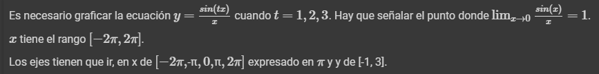
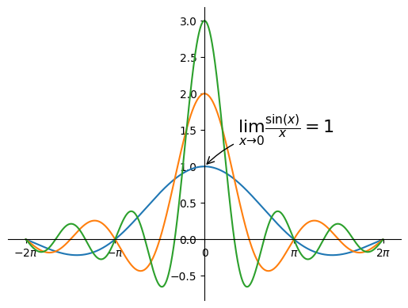
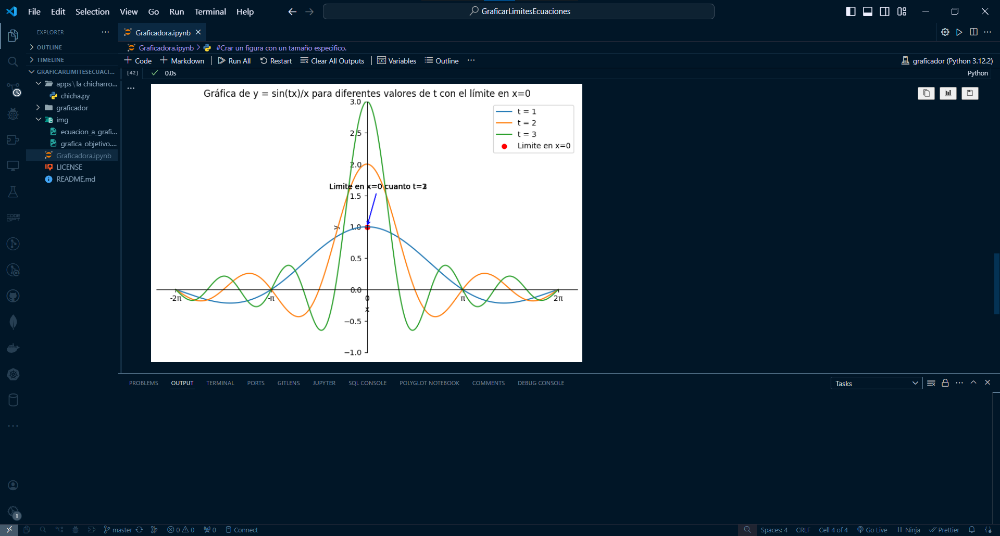

# StreamGrapher
El proyecto StreamGrapher, **Stream** por _Streamlit_ y **Grapher** por _Gráfico_, es un visualizador de datos, que muestra una gráfica de limites de ecuaciones.
 
## Descripción
**StreamGrapher**, es una aplicación web sencilla que ofrece una plataforma intuitiva para la visualización de datos.
Utilizando la potencia de:

[](https://code.visualstudio.com/)

[](https://www.python.org/)

[](https://matplotlib.org/)

[](https://streamlit.io/)

[](https://numpy.org/)

[](https://jupyter.org/)

Permitiendo este _"stack"_ de tecnologías explorar y analizar conjuntos de datos de manera dinámica y eficiente. 

## PIP Módulos
Se uso _PIP_ en **StreamGrapher** para la gestión de paquetes:
```bash
pip install streamlit
```
```bash
pip install numpy
```
```bash
pip install matplotlib
```
```bash
pip install notebook
```
```bash
pip install ipykernel
```

## Visuales
La idea principal fue realizar una replica o aproximación de una grafica proporcionada, esto con el fin de hacer un ejercicio de **Visualizar datos** con las habilidades previamente adquiridas.



Para llegar al objetivo de esta gráfica:



## Empezando
Estas instrucciones te guiaran para obtener una copia de este proyecto en funcionamiento de tu maquina local para propósitos de desarrollo y pruebas.
```bash
git clone https://github.com/JoseTorresMX/graficar-limites-de-ecuaciones.git
```
Gráfica completa, o aproximado a lo que se requería.


## Contribuyendo
Las contribuciones son lo que hacen a la comunidad de código abierto un lugar increíble para aprender, inspirar y crear. Cualquier contribución que hagas es muy apreciada.

## Versionado
Se uso [Git](https://git-scm.com) para el versionado del proyecto.
[](https://git-scm.com/)

[](https://github.com/)

## Autor(es)
- **Jose Torres** - _Trabajo inicial_

[](https://github.com/JoseTorresMX)

[](https://www.linkedin.com/in/josetorresmx/)

## Licencia
Este proyecto esta bajo la licencia MIT - ve el archivo [LICENSE.md](LICENSE.md). Para mas detalles [MIT](https://choosealicense.com/licenses/mit/)

## Expresiones de Gratitud
Estoy agradecido a la comunidad de Python, sobre todo a las comunidades de Facebook a los que estoy admitido, las cuales los miembros se toman el tiempo de brindar consejos, guías, ayudas, etc.

[](https://www.facebook.com/groups/CienciaDeDatosPy/)

[](https://www.facebook.com/groups/275366519230814/)
